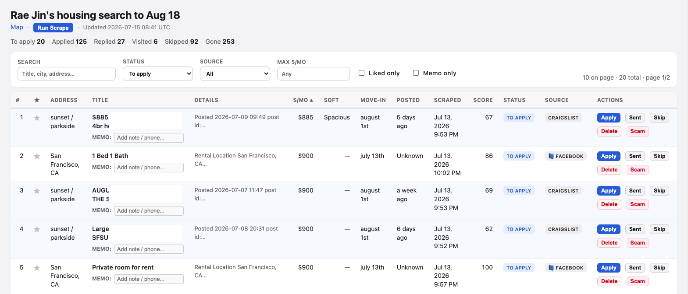

# Looking for Room

**https://github.com/jin-dalrae/2607-lookingforroom**

Local room finder + browser apply queue (Craigslist / Facebook → filter → track outreach).



---

## For people

1. Open this link in a coding agent (Claude Code, Cursor, Codex, Grok, …):  
   **https://github.com/jin-dalrae/2607-lookingforroom**
2. Say only: **“Set me up for Looking for Room.”**
3. Answer the agent’s questions. It installs everything, starts the app, and opens the queue in your browser.

You do **not** need git, terminals, or a long prompt. The agent asks; you answer.

### Your daily tool is the web queue

Once the agent opens **http://127.0.0.1:8765/** (screenshot above), **you work there** — not in chat:

| In the UI | What it does |
|-----------|----------------|
| **Search / status / source / max $/mo** | Filter the table (e.g. To apply only) |
| **Liked only / Memo only** | Show starred or noted rows |
| **★** | Like / shortlist a listing |
| **MEMO** | Type a note or phone number — saved on that row |
| **Apply** | Open outreach (Gmail compose / copy message / listing link) |
| **Sent** | Mark that you already contacted them |
| **Skip** | Not interested — leave the to-apply list |
| **Delete / Scam** | Drop junk or flag scams |
| **Run Scrape** | Ask the backend to pull new listings (when the agent left the API running) |
| **Map** | Approximate pins by neighborhood |
| Stats (To apply / Applied / Replied / …) | How far you are in outreach |

You still send the actual Craigslist / Facebook / email message yourself. The queue remembers status so you don’t double-contact.

---


## For coding agents

You install, configure, run, and maintain the app. Never tell the user to `git clone` or write a criteria essay — **you interview them**.

### 1. First message from user ≈ “set me up”

Immediately ask **these questions** (one batch is fine). Do not invent answers.

| # | Ask |
|---|-----|
| 1 | Full name? |
| 2 | Email? |
| 3 | Phone (for texts / WhatsApp)? |
| 4 | Move-in window (e.g. Aug 1–18, 2026)? |
| 5 | Max monthly budget ($)? |
| 6 | Preferred neighborhoods / areas? |
| 7 | Areas to exclude? |
| 8 | Anything else (room type, pets, lease length, …)? |
| 9 | Scout **Facebook Marketplace** too? (needs a one-time login on their machine) |
| 10 | Set up **Gmail for Craigslist** (drafts + auto-detect landlord replies)? |

Write answers into `profile.yaml` and `lfr/config.py` (`SEARCH_CRITERIA`, `LOCATION_ALLOWED` / `LOCATION_EXCLUDE`, scout URLs).

### 2. Bootstrap (you run this)

```bash
python3 -m venv .venv && source .venv/bin/activate
pip install -r requirements.txt
# fill profile.yaml + lfr/config.py from the interview
python -c "from lfr.db import init_pipeline_tables; init_pipeline_tables()"
python run.py                          # Craigslist scout + score
DETAIL_BACKFILL_LIMIT=0 python listings_page.py
scripts/workers.sh start
# open http://127.0.0.1:8765/
```

| URL | Role |
|-----|------|
| http://127.0.0.1:8765/ | Apply queue |
| http://127.0.0.1:8787/ | API |

Workers: `scripts/workers.sh start|restart|status|stop` · logs `.run/logs/`

Then complete **Facebook** and/or **Gmail (Craigslist mail)** if they said yes (sections below).

### 3. Facebook Marketplace setup (agent)

If they want Facebook listings:

1. Install browser for Playwright (once):
   ```bash
   playwright install chromium
   ```
2. Start login — **never ask for their Facebook password in chat**:
   ```bash
   python scout_facebook.py login
   ```
3. Tell them: a Chromium window will open → they log into Facebook themselves → when the feed/Marketplace is visible, they press **Enter** in the terminal (or you wait if non-interactive timeout).
4. Session is saved to `facebook_state.json` (gitignored). Confirm:
   ```bash
   python -c "from lfr.scout.session import session_configured; print(session_configured())"
   ```
5. Poll Marketplace into the DB:
   ```bash
   python scout_facebook.py poll
   # or full pipeline (skips FB if no session):
   python run.py
   ```
6. Re-export + restart workers so the UI shows new FB rows:
   ```bash
   DETAIL_BACKFILL_LIMIT=0 python listings_page.py
   scripts/workers.sh restart
   ```

Other FB commands: `python scout_facebook.py ingest "<marketplace item url>"` · re-login if polls start failing.

### 4. Gmail + Craigslist mail automation (agent)

Craigslist almost never exposes a public landlord email. Flow is:

| Step | What happens |
|------|----------------|
| Apply | User opens listing / uses queue **Apply** (copy message or Gmail compose) and sends via **Craigslist Reply** (or Gmail if a real address exists) |
| Mark sent | User hits **Mark sent** in the queue → status `sent` in SQLite |
| Auto replies | `mail_monitor.py` watches Gmail IMAP for **Craigslist relay** messages and marks matching apps **replied** |

**Setup Gmail App Password** (when they opted in, or when drafts/replies are needed):

1. Guide them (links only — they create the password):
   - [2-Step Verification](https://myaccount.google.com/security)
   - [App passwords](https://myaccount.google.com/apppasswords) → Mail → 16-char code  
2. **Never** store their normal Gmail password. Write `.env` (from `.env.example`):
   ```env
   GMAIL_ADDRESS=their@gmail.com
   GMAIL_PASSWORD=xxxx xxxx xxxx xxxx
   ```
   (`GMAIL_APP_PASSWORD` also works.) Address should match the inbox they use for Craigslist replies.
3. Verify:
   ```bash
   python -c "from lfr.mail.gmail_creds import gmail_configured, gmail_address; print(gmail_address(), gmail_configured())"
   ```
4. Restart API so drafts work: `scripts/workers.sh restart`
5. One-shot reply check:
   ```bash
   python mail_monitor.py
   python mail_monitor.py --dry-run    # preview without DB writes
   ```
6. Optional background loop (every 5 min):
   ```bash
   python mail_monitor.py --loop 300
   ```

**What the agent should tell the user about Craigslist mail**

- They still **send** the first message (CL Reply form or Gmail compose from the queue).
- After **Mark sent**, landlord replies that land in Gmail via `*@craigslist.org` / relay can be auto-matched.
- Match uses listing post id / fuzzy subject — if a reply is missed, they can mark **Replied** manually in the UI.
- If a listing text has a **direct** email, `send_mail.py` / API draft can send SMTP; most CL rooms will not.

### 5. Scoring — use a subagent

`python filter.py` / `run.py` = local heuristics.  
For a shortlist: spawn a **subagent** to rank **to_apply** against their criteria; return fit / red flags. Don’t rewrite application history.

### 6. Day-to-day

| Task | Command |
|------|---------|
| Refresh (CL + score) | `python run.py` then `scripts/workers.sh restart` |
| Scout CL only | `python scout.py` |
| Scout Facebook | `python scout_facebook.py poll` |
| FB re-login | `python scout_facebook.py login` |
| Export queue | `python listings_page.py` |
| CL reply scan | `python mail_monitor.py` |
| Reply loop | `python mail_monitor.py --loop 300` |

### Do not

- Make the user write a long setup prompt or run git/shell  
- Ask for Facebook or Gmail **login** passwords in chat (App Password + browser login only)  
- Wipe application history or bulk-mark neighborhoods Gone (use location filters)  
- Re-scrape listings already in the DB  
- Require cloud deploy or extra API keys  

Local only. User still sends first outreach; you scout, draft, track status, and auto-flag Craigslist replies in Gmail.
