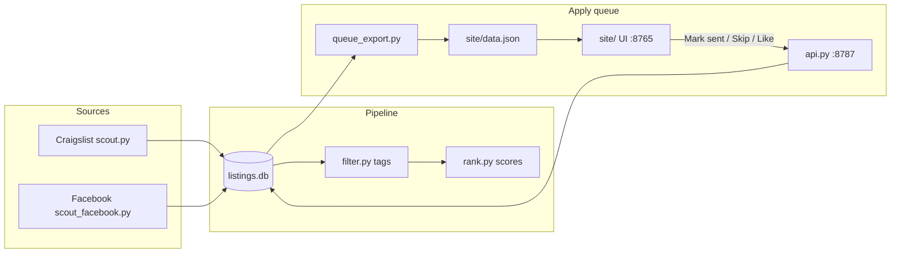

# Looking for Room

A local room-finding system. It scouts Craigslist and Facebook Marketplace, filters listings against configurable criteria, scores and ranks matches, and gives you a browser-based **apply queue** to work through outreach without losing track of what you've sent.

Everything lives in a local SQLite database (`listings.db`). The apply queue is a static site (`site/`) backed by a small local API for status updates and Gmail drafts.

## What it does

| Stage | What happens |
|-------|----------------|
| **Scout** | Polls Craigslist search URLs and Facebook Marketplace (Playwright) for new room listings |
| **Filter** | Tags each listing — move-in window, room type, location zone, scams, transit bonuses |
| **Rank** | Scores listings (Gemini + heuristics) and writes a top-N digest (`digest.md`) |
| **Apply queue** | Exports filtered listings to `site/data.json` for the web UI |
| **Track** | Records sent / skipped / replied status per listing in the `applications` table |

You still send messages yourself (Craigslist relay, Facebook Messenger, or Gmail). The tool finds listings, helps you decide, drafts copy, and remembers what you've already contacted.

## How to use this

1. **Install dependencies**: Create a virtual environment, install requirements, and install Chromium for Facebook scraping:
   ```bash
   python -m venv .venv && source .venv/bin/activate
   pip install -r requirements.txt
   playwright install chromium
   ```
2. **Run interactive setup**: Prompts for search/profile conditions, generates messaging templates, initializes the database, starts background servers, and opens the UI:
   ```bash
   python setup.py
   ```
3. **Scout for listings**: Run the pipeline to populate the queue:
   ```bash
   python run.py
   ```

## Search criteria

Budget, move-in window, location zones, room-type rules, and transit preferences are configured in:

- `config.py` → `SEARCH_CRITERIA`, `SEARCH_URLS`, location/transit settings
- `profile.yaml` → applicant profile and message template

Edit those files (or re-run `python setup.py`) rather than hardcoding criteria in the app.

## How it works



### 1. Scouting

**Craigslist** (`scout.py`) fetches configured search result pages, then visits each listing for the full post body, price, neighborhood, and posted date.

**Facebook Marketplace** (`scout_facebook.py`) uses Playwright with a saved browser session (`facebook_state.json`). After a one-time login it polls the configured search feeds and can backfill listing descriptions on demand.

Both write into `listings.db` via `db.upsert_listing()`.

### 2. Filtering and scoring

`filter.py` reads each listing and sets structured flags in `flags_json`:

- **Move-in fit** — parsed from post text (`listing_move_in.py`) against the configured window
- **Location** — whitelist zones and hard rejects (`locations.py`)
- **Room type** — private vs shared-bedroom / SRO / scam signals
- **Transit** — proximity bonuses from configured transit preferences
- **Rent period** — rejects weekly/daily/sublet when flagged

`rank.py` combines Gemini scoring (when `GCP_KEY` is set) with heuristic bonuses/penalties and produces `digest.md`.

`match.py` exposes `listing_matches_criteria()` — the same rules the apply queue uses for the criteria filter.

### 3. Field extraction

Several small modules parse post text at export time (no duplicate storage in the UI JSON):

| Module | Extracts |
|--------|----------|
| `listing_move_in.py` | Move-in label and sort key (past → now → future) |
| `listing_dates.py` | Posted time ("4 days ago") from post text |
| `listing_size.py` | Square footage |
| `listing_description.py` | Clean description body (details column) |
| `listing_poster.py` | Poster name when visible |
| `locations.py` | Address, neighborhood, city; rejects description prose mistaken for location |

### 4. Apply queue export

`listings_page.py` → `queue_export.py` builds `site/data.json`:

- Pulls the listing pool from SQLite (scored matches + Facebook cards + anything with an application row)
- Runs light backfills (addresses, neighborhoods, posted dates)
- Caps description text to keep the page small
- Embeds one shared `messageTemplate` from `profile.yaml` (not per-row message blobs)

### 5. Apply queue UI

Start the workers:

```bash
scripts/workers.sh start
```

| Service | URL | Role |
|---------|-----|------|
| Queue UI | http://127.0.0.1:8765/ | Table of listings — sort, filter, paginate |
| Apply API | http://127.0.0.1:8787/ | Persist sent / skipped / liked / Gmail draft |
| Map view | http://127.0.0.1:8765/map.html | Approximate pins from neighborhood centroids |

**Apply** is client-side: Craigslist rows open a Gmail compose URL (or copy the message); Facebook rows copy a message with the listing URL appended. No server call until you mark status.

**Mark sent** / **Skip** POST to the API and update SQLite. Refresh the queue with `python listings_page.py` or `scripts/workers.sh restart` (which re-exports automatically).

Workers run detached (survive terminal close). Logs: `.run/logs/`. macOS LaunchAgents: `scripts/workers.sh install`.

### 6. Application tracking

Statuses in the `applications` table: `draft` → `sent` → `replied` → `toured` → `accepted` / `rejected`, plus `skipped`.

| Action | Apply queue | CLI | Telegram |
|--------|-------------|-----|----------|
| Mark sent | Mark sent button | `python sync.py --url <url>` | `/sent <url>` |
| Skip | Skip button | — | — |
| Landlord replied | — | `python mail_monitor.py` | `/mail` |
| Pipeline view | Status filters | `python sync.py --status` | `/apps` |

Gmail inbox monitoring (`mail_monitor.py`) matches Craigslist relay replies to sent applications and can bump status to `replied`.

## Setup

```bash
cd 2607-lookingforroom
python -m venv .venv
source .venv/bin/activate
pip install -r requirements.txt
playwright install chromium   # for Facebook scout only

# Run the interactive setup script
python setup.py
```

Setup asks for profile conditions (contact info, move-in window, budget), generates templates, starts the local server, and opens the UI. Edit `profile.yaml` directly or re-run `python setup.py` anytime.

### Facebook Marketplace

```bash
python scout_facebook.py login    # one-time browser login
python scout_facebook.py poll     # poll searches
```

Session is stored in `facebook_state.json` (gitignored). Re-login if polls fail.

### Run the pipeline

```bash
python run.py                     # full: scout + facebook + filter + rank
python run.py --scout-only
python run.py --filter-only
python run.py --top 10            # print top 10 after run
```

Suggested cron interval: see `POLL_INTERVAL_HOURS` in `config.py`.

### Deploy the apply queue (optional)

Push the static site to Cloudflare Pages:

```bash
scripts/deploy-pages.sh
```

The UI works read-only on Pages. **Mark sent / Skip** need the local API (or a tunneled `APPLY_API_PUBLIC_URL` in `.env`).

## Telegram bot (optional)

For mobile alerts and drafts:

```bash
python bot.py
```

Set `TELEGRAM_BOT_TOKEN` in `.env`, then open your bot in Telegram and tap **Start** once.

Useful commands: `/run` `/apply` `/sent` `/apps` `/mail` `/help`

One-shot alerts after a pipeline run:

```bash
python run.py --alert
```

## Gmail

OAuth is recommended for inbox monitoring and optional Gmail drafts:

```bash
python oauth_setup.py             # one-time consent
python -c "import gmail_auth; print(gmail_auth.auth_status())"
```

Set `GMAIL_OAUTH_CLIENT_ID`, `GMAIL_OAUTH_CLIENT_SECRET`, and `GMAIL_ADDRESS` in `.env`. App Password (`GMAIL_APP_PASSWORD`) works as a fallback.

**Craigslist note:** listings rarely expose a direct email. Most outreach is copy-paste into Craigslist Reply or the apply queue's Gmail compose link. `/send` and `send_mail.py` only work when an address appears in the post text.

## Project layout

```
profile.yaml          Applicant profile and message template
config.py             Search criteria, URLs, location zones
run.py                CLI pipeline orchestrator
bot.py                Telegram bot

scout.py              Craigslist fetcher
scout_facebook.py     Facebook Marketplace (Playwright)
filter.py             Listing tags and Gemini scoring
rank.py               Top-N digest
match.py              Hard filter for apply-queue matches
apply.py              Draft builder
outreach.py           Batch drafts for top listings

db.py                 SQLite — listings, scores, applications
sync.py               CLI status updates
queue_export.py       Builds site/data.json
listings_page.py      Export CLI
api.py                Local apply API (sent / skip / like / draft)

locations.py          Address parsing and location zones
listing_move_in.py    Move-in date parsing
listing_dates.py      Posted-date parsing
listing_description.py  Description extraction
listing_size.py       Sqft extraction
listing_poster.py     Poster name extraction

site/                 Apply queue static UI
  index.html          Main table
  app.js              Filters, sort, pagination, apply actions
  data.json           Generated listing export
  map.html            Map view

scripts/
  workers.sh          Start/stop detached UI + API
  deploy-pages.sh     Cloudflare Pages deploy
  backfill-fb-details.sh  Facebook description backfill

listings.db           Runtime database (gitignored)
digest.md             Generated ranked digest
```

## Daily workflow

1. **Refresh listings** — `python run.py` (or cron / `/run` in Telegram).
2. **Re-export queue** — `scripts/workers.sh restart` or `python listings_page.py`.
3. **Work the queue** — http://127.0.0.1:8765/ — filter to "To apply", sort by score, apply to promising rows.
4. **Mark sent** after each outreach so you don't double-contact.
5. **Check mail** — `python mail_monitor.py` or `/mail` for landlord replies.
6. **Facebook groups** — still manual; Marketplace is automated.

## Configuration reference

- **Search URLs** — `config.py` → `SEARCH_URLS`, `FACEBOOK_SEARCHES`
- **Location allow/exclude** — `config.py` → `LOCATION_ALLOWED`, `LOCATION_EXCLUDE`
- **Transit preferences** — `config.py` → `TRANSIT_PREFERENCES`
- **Export limits** — `DETAIL_BACKFILL_LIMIT`, `POSTED_BACKFILL_LIMIT` env vars in `queue_export.py`
- **API auth** — optional `APPLY_API_TOKEN` bearer token for `api.py`

## Search strategy

1. **Cast a wide net** — broad Craigslist/Facebook searches with a max price in the URL.
2. **Filter hard** — location zones, move-in window, room type, scams, stale posts.
3. **Rank by fit** — rent, preferred areas, transit, and other configured bonuses.
4. **Act fast** — good rooms go quickly; the queue sorts by score and posted date.
5. **View in person** — never send a deposit without seeing the room and meeting roommates.
